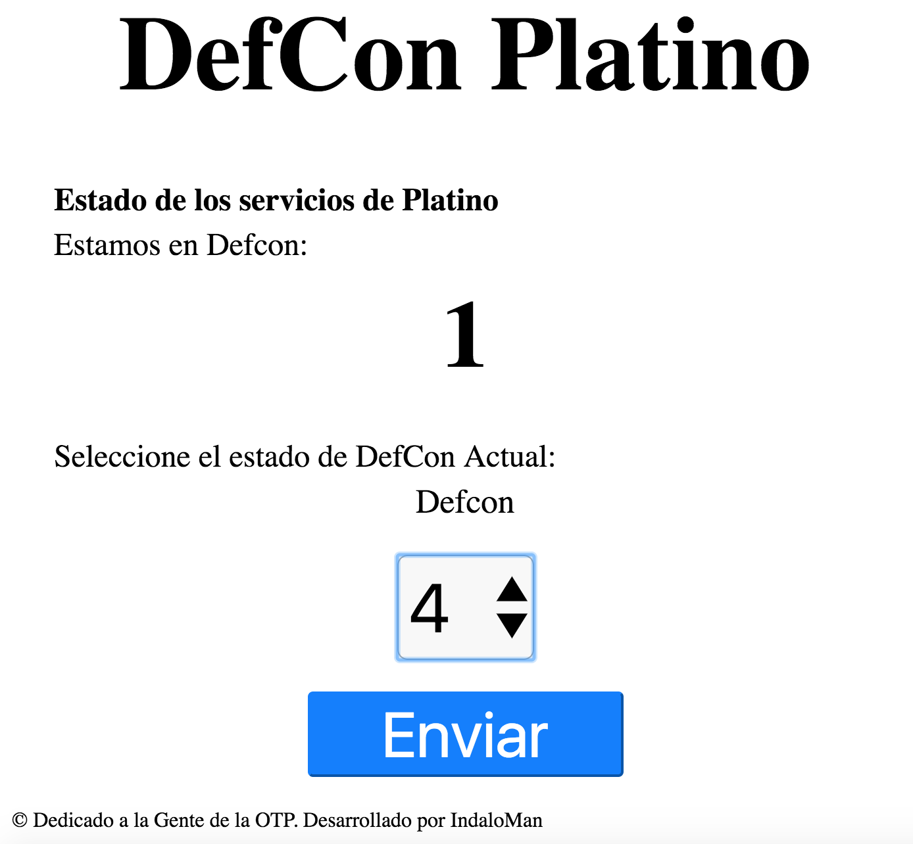

# defconupython
Defcon Wifi Signal With MicroPython

Señal de defcon con wifi integrado utilizando el ESP8266. Este proyecto utiliza la placa [Wemos D1 Mini](https://wiki.wemos.cc/products:d1:d1_mini).
Este código corresponde a la mejora de una señal defcon para la Oficina Ténica de Platino. Seguidamente se muestran la imagenes de pines de la Wemos D1 mini.

## Ejemplo de uso

Para poder cambiar el estado del defcon, nos conectaremos a la wifi que corresponde a este proyecto y nos conectaremos a la web correspondiente.
Que se encontará en la dirección http://192.168.4.1

Para cambiar de estado se selecciona el estado del formulario y se pulsa en enviar.

## Lista de Pines

| pin | descripcion |
| --- | ----------- |
| D0 | Defcon 1 |
| D5 | Defcon 2 |
| D6 | Defcon 3 |
| D7 | Defcon 4 |
| D8 | Defcon 5 |
| V5 | Alimentación poner a 5 Voltios |
| GND | Tierra |
 
